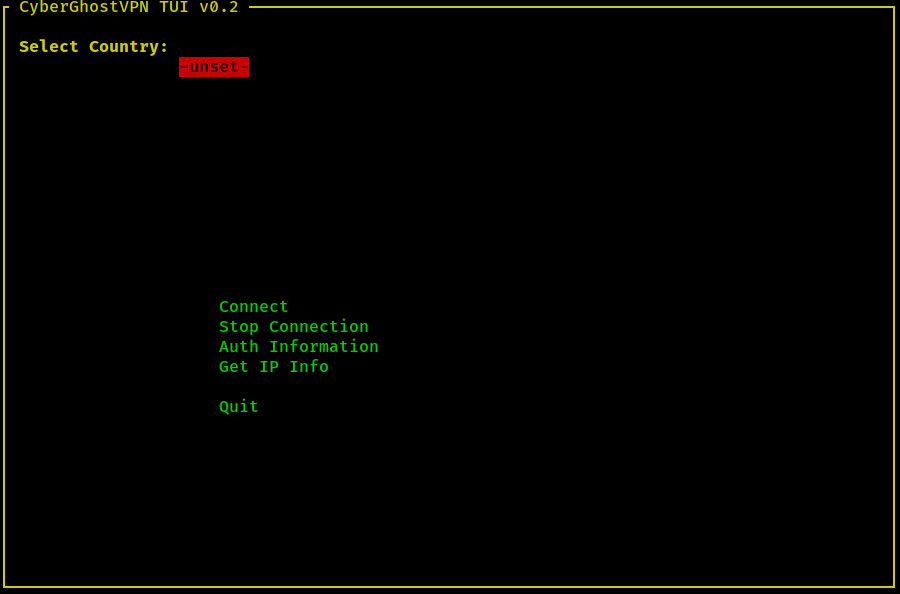

# GhostVPN
  

<br><b>Simple and lightweight TUI application for CyberGhostVPN.</b><br>

# Screenshot

[](https://asciinema.org/a/469682?autoplay=1)

# Usage
```bash
sudo python3 ghostui.py
```

# Setup
```bash
sudo pip3 install -r requirements.txt
```

## For Ubuntu based systems
```bash
sudo -H pip3 install -r requirements.txt
```